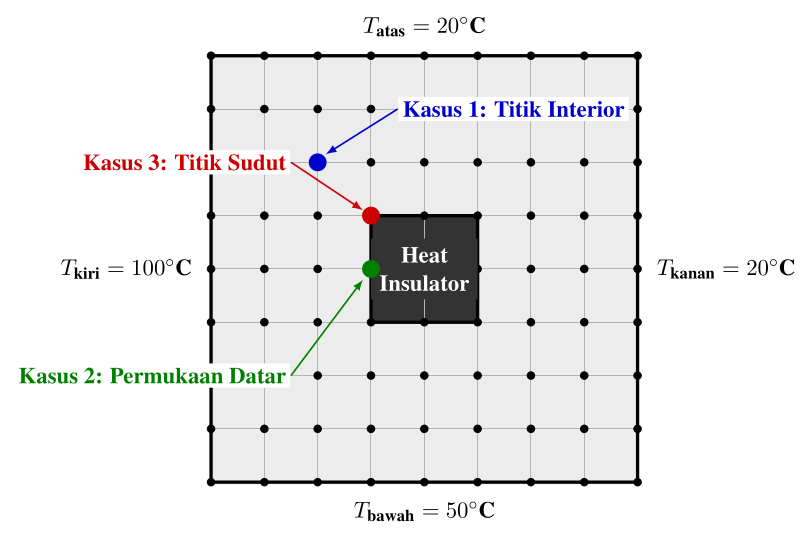
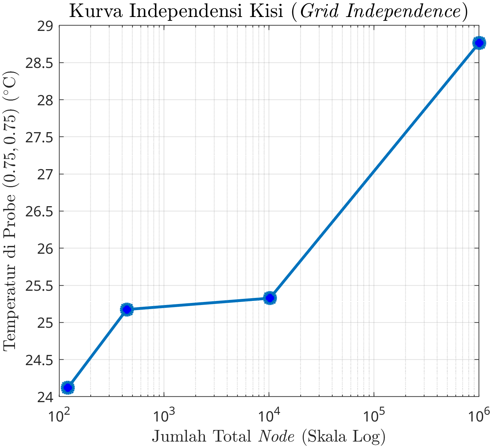
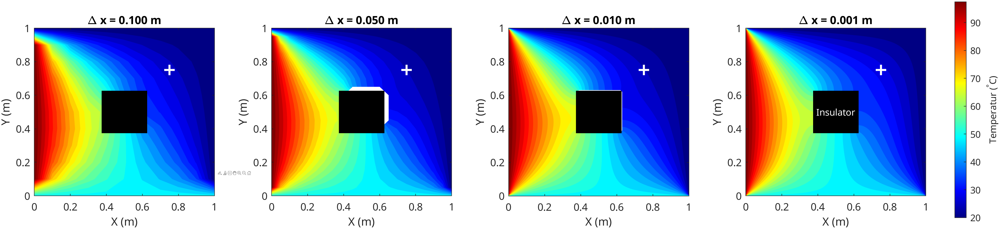
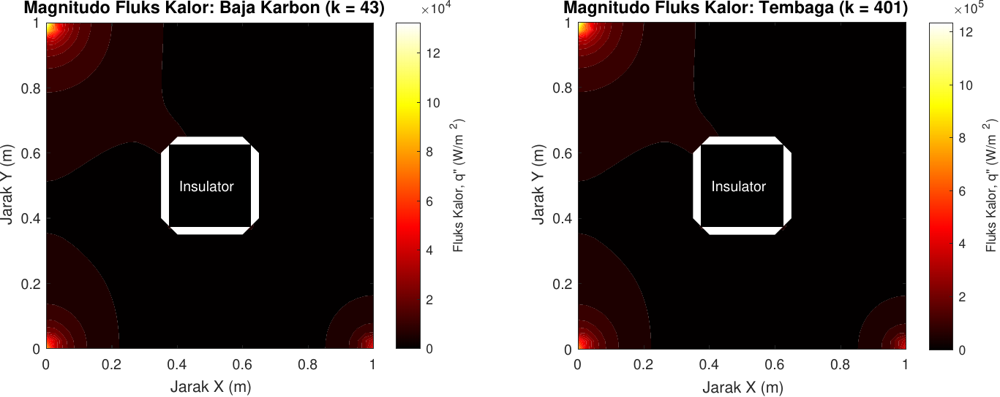

# 2D Steady-State Temperature Distribution Solver using Finite Difference Method (FDM)

This repository provides a MATLAB-based numerical solver for the two-dimensional steady-state heat conduction equation on a square plate with an internal insulated obstacle. The solver is implemented using the Finite Difference Method (FDM) with a Gauss-Seidel iterative scheme.

---

## 1. Physical and Mathematical Model

### 1.1. Governing Equation
The general three-dimensional heat diffusion equation in Cartesian coordinates is given by:
$$\frac{\partial}{\partial x} \left( k \frac{\partial T}{\partial x} \right) + \frac{\partial}{\partial y} \left( k \frac{\partial T}{\partial y} \right) + \frac{\partial}{\partial z} \left( k \frac{\partial T}{\partial z} \right) + \dot{q} = \rho c_p \frac{\partial T}{\partial t}$$

Applying the following physical simplifications:
1. **Steady-state conditions**: $\frac{\partial T}{\partial t} = 0$.
2. **Two-dimensional heat transfer**: Negligible heat flow in the $z$-direction, so $\frac{\partial}{\partial z} \left( k \frac{\partial T}{\partial z} \right) = 0$.
3. **Homogeneous and isotropic material**: Constant thermal conductivity $k$ throughout the domain.
4. **No internal heat generation**: $\dot{q} = 0$.

The governing equation reduces to the **2D Laplace Equation**:
$$\frac{\partial^2 T}{\partial x^2} + \frac{\partial^2 T}{\partial y^2} = 0 \quad \text{or} \quad \nabla^2 T = 0$$

### 1.2. Discretization of Interior Nodes
Using the second-order accurate central difference approximation for spatial derivatives on a uniform grid where $\Delta x = \Delta y$:
$$\frac{T_{m+1,n} - 2T_{m,n} + T_{m-1,n}}{(\Delta x)^2} + \frac{T_{m,n+1} - 2T_{m,n} + T_{m,n-1}}{(\Delta y)^2} = 0$$

For any **interior node** (fully surrounded by the solid metal domain), solving for $T_{m,n}$ yields the standard arithmetic average formula:
$$T_{m,n} = \frac{T_{m+1,n} + T_{m-1,n} + T_{m,n+1} + T_{m,n-1}}{4}$$

---

## 2. Domain and Boundary Conditions



The plate has dimensions of $1.0\text{ m} \times 1.0\text{ m}$ with a $0.25\text{ m} \times 0.25\text{ m}$ square adiabatic insulator centered at its middle (from $x, y = 0.375\text{ m}$ to $x, y = 0.625\text{ m}$).

### 2.1. Outer Boundary Conditions (Dirichlet)
* **Left Boundary ($x = 0$):** $T_{\text{left}} = 100^\circ\text{C}$
* **Right Boundary ($x = 1.0\text{ m}$):** $T_{\text{right}} = 20^\circ\text{C}$
* **Top Boundary ($y = 1.0\text{ m}$):** $T_{\text{top}} = 20^\circ\text{C}$
* **Bottom Boundary ($y = 0$):** $T_{\text{bottom}} = 50^\circ\text{C}$

### 2.2. Inner Insulator Boundary Conditions (Neumann)
The central square obstacle is a perfect insulator, meaning it is adiabatic:
$$\frac{\partial T}{\partial n} = 0 \quad \Longrightarrow \quad q'' = 0$$

Since the physical domain has a material discontinuity (the insulator), the finite difference equations on the insulator boundaries must be derived using either **Imaginary Nodes** (mathematical approach) or the **Energy Balance Method** (physical approach). Both methods yield identical results.

#### A. Derivation of Flat Insulator Boundaries
Consider the **left side of the insulator** (where the insulator is directly to the right of node $(m,n)$ at $x = 0.375\text{ m}$):

##### Method 1: Imaginary Nodes (Central Difference)
Using central difference at $(m,n)$ for the normal gradient:
$$\left(\frac{\partial T}{\partial x}\right)_{m,n} \approx \frac{T_{m+1,n} - T_{m-1,n}}{2\Delta x} = 0 \quad \Longrightarrow \quad T_{m+1,n} = T_{m-1,n}$$
Here, the node $(m+1,n)$ lies inside the insulator and is treated as an *imaginary node*. Substituting this relation into the standard interior node equation:
$$T_{m,n} = \frac{T_{m+1,n} + T_{m-1,n} + T_{m,n+1} + T_{m,n-1}}{4}$$
$$T_{m,n} = \frac{T_{m-1,n} + T_{m-1,n} + T_{m,n+1} + T_{m,n-1}}{4} = \frac{2T_{m-1,n} + T_{m,n+1} + T_{m,n-1}}{4}$$

##### Method 2: Energy Balance Method ($\sum q_{\text{in}} = 0$)
Assuming a unit thickness of $1\text{ m}$, the heat transfer rates into a control volume of size $\frac{\Delta x}{2} \times \Delta y$ around the boundary node $(m,n)$ are:
* $q_{\text{left}} = k \cdot (\Delta y \cdot 1) \cdot \frac{T_{m-1,n} - T_{m,n}}{\Delta x}$
* $q_{\text{top}} = k \cdot \left(\frac{\Delta x}{2} \cdot 1\right) \cdot \frac{T_{m,n+1} - T_{m,n}}{\Delta y}$
* $q_{\text{bottom}} = k \cdot \left(\frac{\Delta x}{2} \cdot 1\right) \cdot \frac{T_{m,n-1} - T_{m,n}}{\Delta y}$
* $q_{\text{right}} = 0$ (adiabatic boundary)

Summing the heat transfer rates ($\sum q_{\text{in}} = 0$) and dividing by $k$ (since $k \neq 0$):
$$\Delta y \frac{T_{m-1,n} - T_{m,n}}{\Delta x} + \frac{\Delta x}{2} \frac{T_{m,n+1} - T_{m,n}}{\Delta y} + \frac{\Delta x}{2} \frac{T_{m,n-1} - T_{m,n}}{\Delta y} = 0$$
Since $\Delta x = \Delta y$, this simplifies to:
$$(T_{m-1,n} - T_{m,n}) + \frac{1}{2} (T_{m,n+1} - T_{m,n}) + \frac{1}{2} (T_{m,n-1} - T_{m,n}) = 0$$
Multiplying the entire equation by 2:
$$2(T_{m-1,n} - T_{m,n}) + (T_{m,n+1} - T_{m,n}) + (T_{m,n-1} - T_{m,n}) = 0$$
$$2T_{m-1,n} + T_{m,n+1} + T_{m,n-1} - 4T_{m,n} = 0 \quad \Longrightarrow \quad T_{m,n} = \frac{2T_{m-1,n} + T_{m,n+1} + T_{m,n-1}}{4}$$

##### Discretized Equations for All Flat Insulator Boundaries:
* **Left Edge of Insulator** (insulator is to the right):
  $$T_{m,n} = \frac{2T_{m-1,n} + T_{m,n+1} + T_{m,n-1}}{4}$$
* **Right Edge of Insulator** (insulator is to the left):
  $$T_{m,n} = \frac{2T_{m+1,n} + T_{m,n+1} + T_{m,n-1}}{4}$$
* **Bottom Edge of Insulator** (insulator is above):
  $$T_{m,n} = \frac{2T_{m,n-1} + T_{m+1,n} + T_{m-1,n}}{4}$$
* **Top Edge of Insulator** (insulator is below):
  $$T_{m,n} = \frac{2T_{m,n+1} + T_{m+1,n} + T_{m-1,n}}{4}$$

#### B. Derivation of Insulator Corner Nodes
For a node located at one of the outer corners of the insulator, the solid domain occupies $3/4$ of the surrounding control volume (an L-shaped control volume of total area $\frac{3}{4} \Delta x \Delta y$). 

Consider the **top-left corner of the insulator** (at $i = i1, j = j2$, where the insulator lies below and to the right of the node):
Using the Energy Balance Method:
* $q_{\text{left}} = k \cdot (\Delta y \cdot 1) \cdot \frac{T_{m-1,n} - T_{m,n}}{\Delta x}$
* $q_{\text{top}} = k \cdot (\Delta x \cdot 1) \cdot \frac{T_{m,n+1} - T_{m,n}}{\Delta y}$
* $q_{\text{right}} = k \cdot \left(\frac{\Delta y}{2} \cdot 1\right) \cdot \frac{T_{m+1,n} - T_{m,n}}{\Delta x}$ (only the top half of the face is solid)
* $q_{\text{bottom}} = k \cdot \left(\frac{\Delta x}{2} \cdot 1\right) \cdot \frac{T_{m,n-1} - T_{m,n}}{\Delta y}$ (only the left half of the face is solid)

Summing these terms ($\sum q_{\text{in}} = 0$) with $\Delta x = \Delta y$:
$$(T_{m-1,n} - T_{m,n}) + (T_{m,n+1} - T_{m,n}) + \frac{1}{2}(T_{m+1,n} - T_{m,n}) + \frac{1}{2}(T_{m,n-1} - T_{m,n}) = 0$$
Multiplying by 2:
$$2(T_{m-1,n} - T_{m,n}) + 2(T_{m,n+1} - T_{m,n}) + (T_{m+1,n} - T_{m,n}) + (T_{m,n-1} - T_{m,n}) = 0$$
$$2T_{m-1,n} + 2T_{m,n+1} + T_{m+1,n} + T_{m,n-1} - 6T_{m,n} = 0 \quad \Longrightarrow \quad T_{m,n} = \frac{2T_{m-1,n} + 2T_{m,n+1} + T_{m+1,n} + T_{m,n-1}}{6}$$

##### Discretized Equations for All Insulator Corner Nodes:
* **Top-Left Corner** (insulator is to the right and below):
  $$T_{m,n} = \frac{2T_{m-1,n} + 2T_{m,n+1} + T_{m+1,n} + T_{m,n-1}}{6}$$
* **Bottom-Left Corner** (insulator is to the right and above):
  $$T_{m,n} = \frac{2T_{m-1,n} + 2T_{m,n-1} + T_{m+1,n} + T_{m,n+1}}{6}$$
* **Top-Right Corner** (insulator is to the left and below):
  $$T_{m,n} = \frac{2T_{m+1,n} + 2T_{m,n+1} + T_{m-1,n} + T_{m,n-1}}{6}$$
* **Bottom-Right Corner** (insulator is to the left and above):
  $$T_{m,n} = \frac{2T_{m+1,n} + 2T_{m,n-1} + T_{m-1,n} + T_{m,n+1}}{6}$$

---

## 3. Grid Independence Test

To evaluate the numerical sensitivity and find the optimal balance between spatial accuracy and computational cost, a grid independence analysis was performed. 

The evaluation tested four step sizes: $\Delta x \in \{0.100\text{ m}, 0.050\text{ m}, 0.010\text{ m}, 0.001\text{ m}\}$ under a convergence tolerance of $\epsilon = 10^{-4}$:

1. **Geometric Distortion (Truncation Error) at $\Delta x = 0.050\text{ m}$:**
   At a step size of $\Delta x = 0.050\text{ m}$, a geometrical truncation error occurs because the $0.375\text{ m}$ boundary position of the insulator is not perfectly divisible by the step size. This creates numerical approximation artifacts (visible as small white gap artifacts around the insulator boundary in the contour plots). Using grid resolutions of $\Delta x = 0.01\text{ m}$ or finer completely resolves this distortion.
   
2. **Convergence at $\Delta x = 0.010\text{ m}$:**
   For a grid size of $\Delta x = 0.010\text{ m}$ ($10,201$ nodes), the temperature at the probe point $(0.75, 0.75)$ seems to converge around $25.3^\circ\text{C}$. This grid provides sub-second computations and is suitable for rapid design iterations.

3. **High-Fidelity Correction at $\Delta x = 0.001\text{ m}$:**
   At the finest grid size of $\Delta x = 0.001\text{ m}$ ($1,002,001$ nodes), the temperature at the probe point is corrected to $\approx 28.8^\circ\text{C}$. This significant adjustment reveals the existence of a high temperature gradient/singularity near the sharp corners of the adiabatic insulator. Coarser grids undergo significant numerical diffusion and fail to capture the true physical gradient around this singularity.

4. **Computational Cost Trade-off:**
   While the $\Delta x = 0.001\text{ m}$ grid captures the true physical field, the computational cost grows exponentially due to the massive number of equations. The calculation requires 15 to 20 minutes to solve, compared to sub-second runtimes for coarser grids. Selecting the final resolution requires an engineering compromise between available time and required precision.

---

## 4. Material Variation & Heat Flux Analysis

The study compares the steady-state thermal behavior of two materials:
* **Copper (Tembaga):** $k_{\text{Cu}} = 401\text{ W/m}\cdot\text{K}$
* **Carbon Steel (Baja Karbon):** $k_{\text{CS}} = 43\text{ W/m}\cdot\text{K}$

### 4.1. Temperature Profile Independence
Under steady-state conditions with no internal heat generation, the governing heat equation is:
$$k \left( \frac{\partial^2 T}{\partial x^2} + \frac{\partial^2 T}{\partial y^2} \right) = 0$$
Since the thermal conductivity $k \neq 0$, dividing both sides by $k$ yields:
$$\nabla^2 T = 0$$
Thus, the temperature field $T(x,y)$ depends solely on the boundary values (Dirichlet) and domain geometry, making it independent of the material's thermal conductivity. Consequently, **both Copper and Carbon Steel yield identical temperature distribution profiles**.

### 4.2. Heat Flux Scaling
The material's thermal conductivity $k$ directly and proportionally scales the magnitude of the heat flux vector field $|\vec{q}''|$. According to Fourier's Law:
$$\vec{q}'' = -k \nabla T \quad \Longrightarrow \quad |\vec{q}''| = k \sqrt{ \left( \frac{\partial T}{\partial x} \right)^2 + \left( \frac{\partial T}{\partial y} \right)^2 }$$
Because the temperature gradients $\nabla T$ are identical, the ratio of heat fluxes at any point matches the ratio of their thermal conductivities:
$$\frac{|\vec{q}''_{\text{Copper}}|}{|\vec{q}''_{\text{Carbon Steel}}|} = \frac{k_{\text{Copper}}}{k_{\text{Carbon Steel}}} = \frac{401}{43} \approx 9.33$$
Copper transmits heat energy $\approx 9.33$ times faster than Carbon Steel for the same temperature distribution.

---

## 5. Visualizations

### 5.1. Grid Independence Curve
The grid independence curve shows the temperature at the probe point $(0.75, 0.75)$ plotted against the total number of nodes (logarithmic scale):



### 5.2. Temperature Contour Plots
Below is the comparison of 2D temperature contour maps across different grid sizes. The probe point is marked with a white plus ($+$) sign:



### 5.3. Heat Flux Comparison
This panel compares the magnitude of the heat flux vector field $|\vec{q}''|$ for Carbon Steel (left) and Copper (right), illustrating the linear scaling of the flux magnitude with $k$:



---

## 6. How to Run

To run the simulation and generate these plots, you need MATLAB installed on your system.

1. **Clone or download** this repository to your local drive.
2. Open MATLAB and navigate to the project root directory.
3. Run the grid independence test script:
   ```matlab
   BedaHingga_AnalisisVariasiGrid
   ```
   *This script tests grid sizes $\Delta x \in \{0.1, 0.05, 0.01\}$ and plots the 2D contour maps and grid convergence curve.*
4. Run the material variation script:
   ```matlab
   BedaHingga_AnalisisVariasiMaterial
   ```
   *This script runs the solver with a highly refined grid ($\Delta x = 0.001\text{ m}$) and computes/plots the heat flux magnitude differences between Carbon Steel and Copper.*
